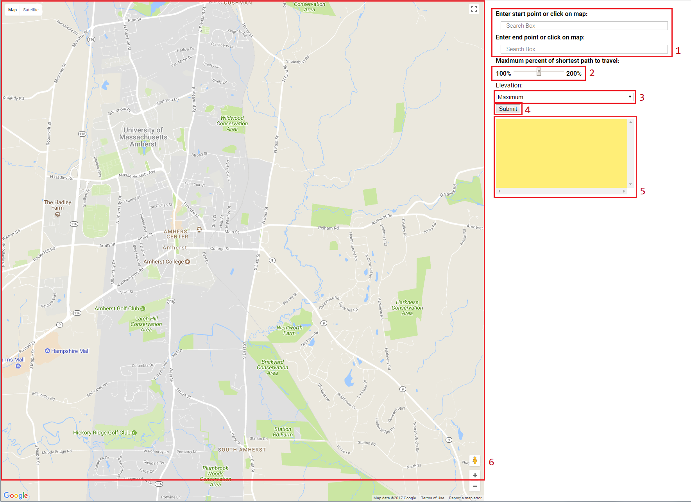
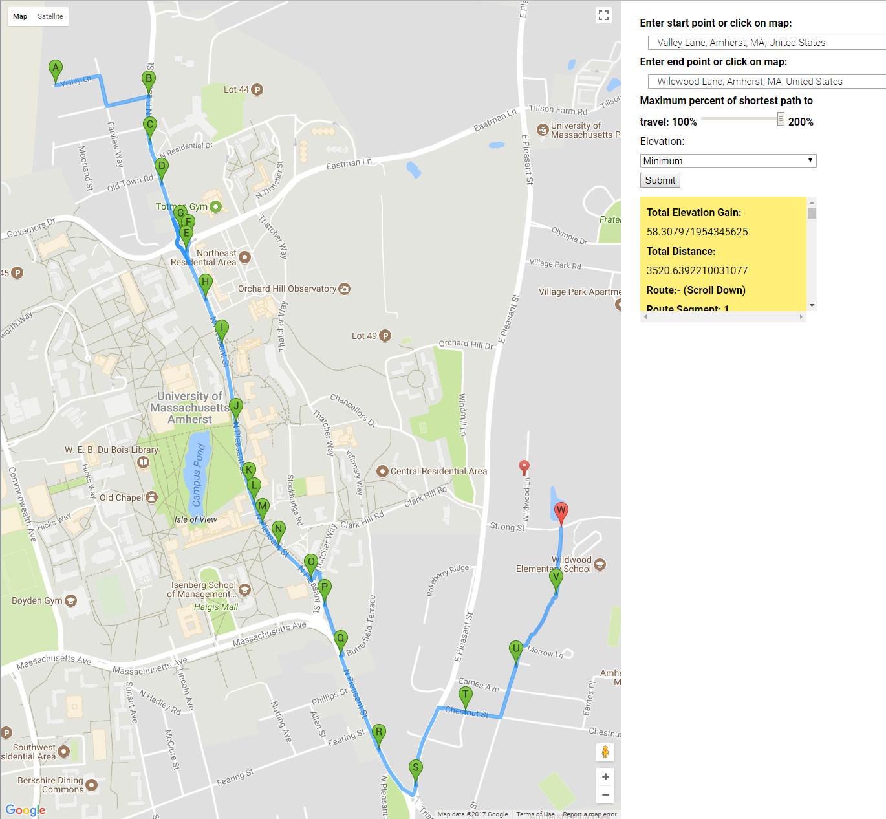
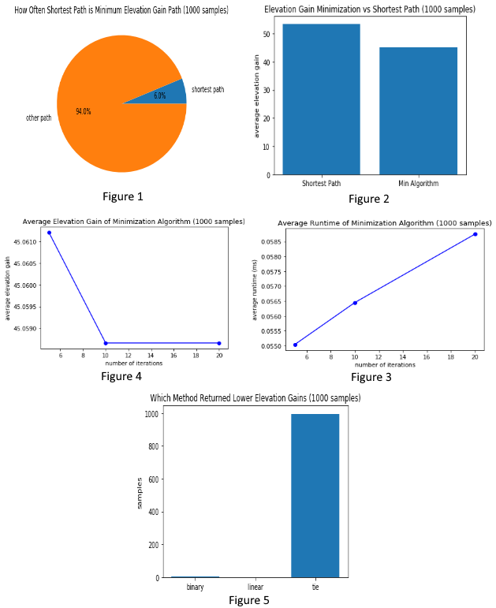
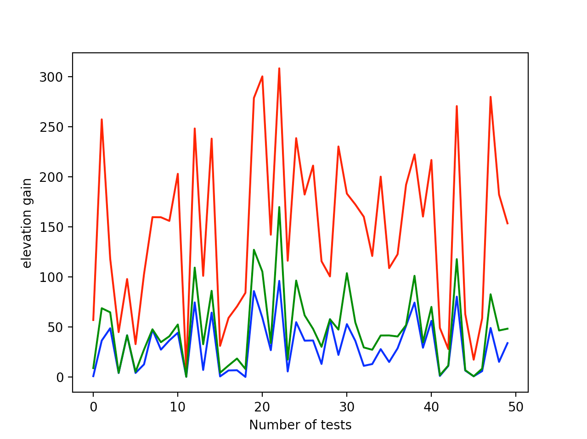

# EleNa
Elevation-based Navigation (EleNa) is a map based application that gives the user a hiking route between any two points on the map that either minimizes or maximizes the elevation gain and is within “x%” of the shortest path possible where x is user specified.

### By RandomMax:
Bhuvana Surapaneni, Jeremy Doyle, Benjamin Guinsburg, Dilip Chakravarthy Kavarthapu, Pratik Mehta

# Set-up

### Installing OSMnx
with pip:
```
pip install osmnx
```
Note: If you are pip installing OSMnx, install geopandas and rtree first. It's easiest to use conda-forge to get these dependencies installed.

with conda:
```
conda install -c conda-forge osmnx
```

### Installing google-maps-services-python
```
pip install -U googlemaps

```
### Installing CORS Google Chrome Extension
Download Link:  
https://chrome.google.com/webstore/detail/allow-control-allow-origi/nlfbmbojpeacfghkpbjhddihlkkiljbi?hl=en

# Using the Application

Make sure you have osmnx, googlemaps, and the CORS extension installed.  

flask/app/routes.py has the code to render the HTML.  
To run flask:
```
cd flask
__________________________________________
export FLASK_APP=microblog.py #On OSX
set FLASK_APP=microblog.py    #On Windows
__________________________________________
flask run                     #Alternatively: python -m flask run
```
Open templates/index.html in Google Chrome web browser.

### Using the Interface


1. Here, you would click somewhere on the map to the left to input a starting point for your route, then you would click elsewhere on the map to input your destination. Alternatively, you may also manually enter those points in the space provided.

2. This slider determines how much longer the generated route will be than the shortest route between your two points. Going from 100%, which returns the shortest route, up to 200%, or twice as long as the shortest route.

3. This dropdown menu will let you select whether you want to have more elevation gain in your path, or less. That is to say, would you like to have more uphill segments along your route? or would you like to have more downhill or flat segments along your route?

4. This button takes the provided information and calculates a path for you given the constrains that you have set.
5. This box will contain the elevation gain of the generated route, its total length, as well as specific information about the segments of the generated route.

6. This map is used to specify where you'd like your start and endpoints to be, and once a route is created for you, it will be drawn onto this map.

# Examples

### Minimization


In this example, we try to minimize elevation gain along our route from Valley Lane, Amherst, to Wildwood Lane, Amherst. We type in the street addresses into the appropriate boxes, and for this case we choose a maximum percent of shortest path to be 200%. We choose "minimum" from the "Elevation" dropdown menu, and then click submit for EleNa to generate our route. The path is then seen on the map.


### Maximization


In this example, we try to maximize elevation gain along our route starting from the Haigis Mall in Umass Amherst, and ending on Olympia Drive, Amherst. The two addresses and written into the appropriate boxes and we change the slider to be 200%, and choose to maxmize elevation by choosing "maximum" under the "Elevation" dropdown menu. After clicking submit, we have a path with many uphill segments.

# Algorithm Analysis

### Minimization


These figures have been produced by randomly sampling 1000 source and target nodes in a graph of Amherst, MA, using 200% of the shortest distance path as the maximum distance constraint. Figure 1 and Figure 2 show that our algorithm does in fact find lower elevation gains than the shortest path by being allowed to travel a longer distance. The algorithm chosen to do so searches over alpha, and with each iteration produces the minimum weighted path were the weight is the linear combination: alpha * normalized elevation gain + (1 - alpha) * normalized length. The chosen search method is binary, which enables us to narrow in on small areas of the linear combination to explore further. To justify this decision we tested an evenly distributed linear search over alpha with the same number of iterations (and thus similar runtime), and found that, while overall very similar, in a few cases the binary search did find smaller elevation gain paths than the linear method, and in no cases did the linear method find a smaller elevation gain path than the binary method (Figure 5). The number of iterations used in our binary search has a direct impact on the runtime, although it does not grow particularly fast (Figure 4). Regardless of this, we found similar results in most cases while increasing the number of iterations above 10, but when decreasing the number of iterations we noticed poor performance (Figure 3).



The figure above shows the max elevation gain path, shortest path and min elevation gain path for 50 random pairs of from and to nodes. Shown here, red represents the elevation gain maximizing path, green represents the shortest path, and blue represents the elevation gain minimizing path
